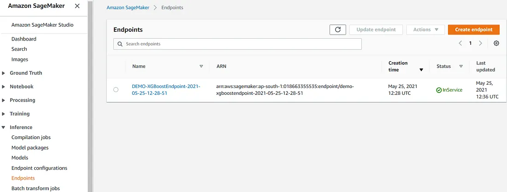
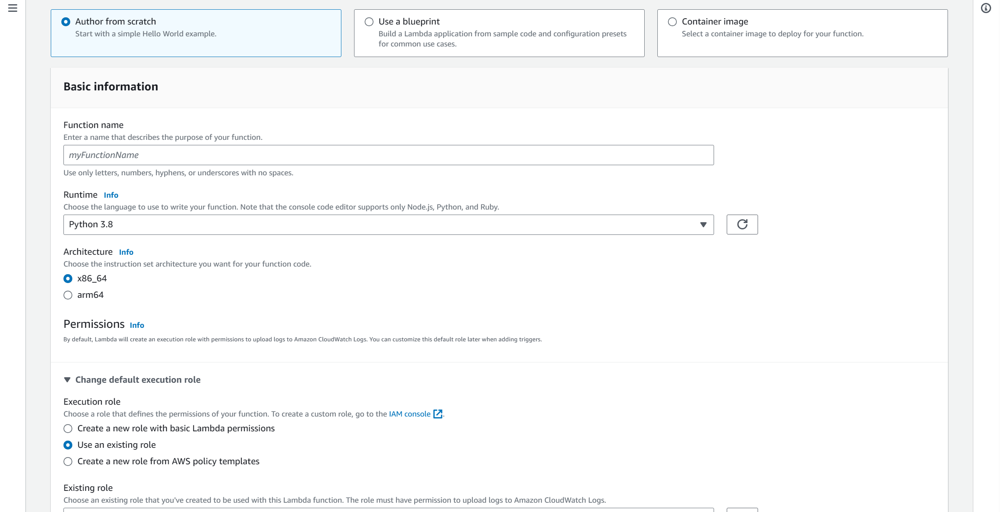
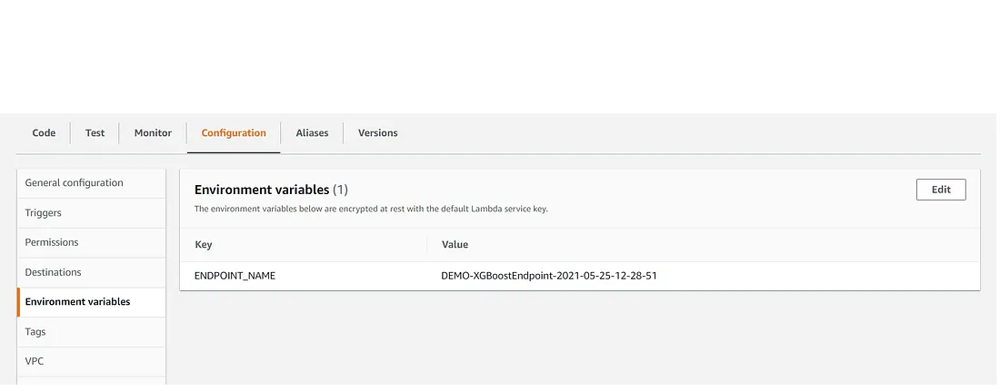
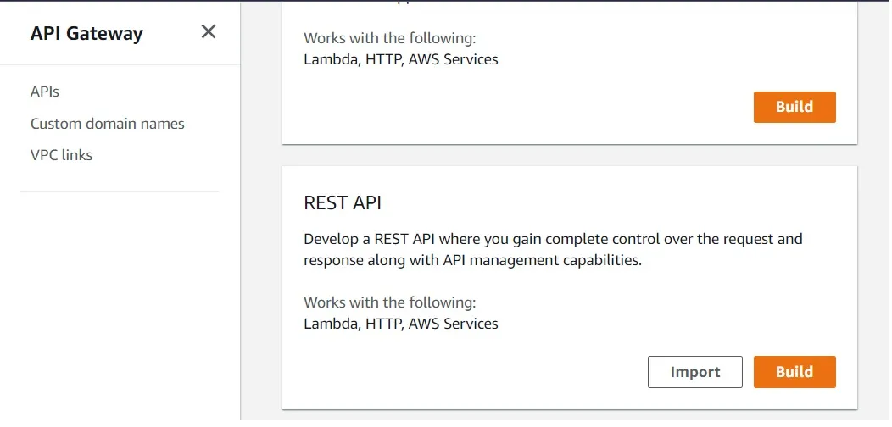
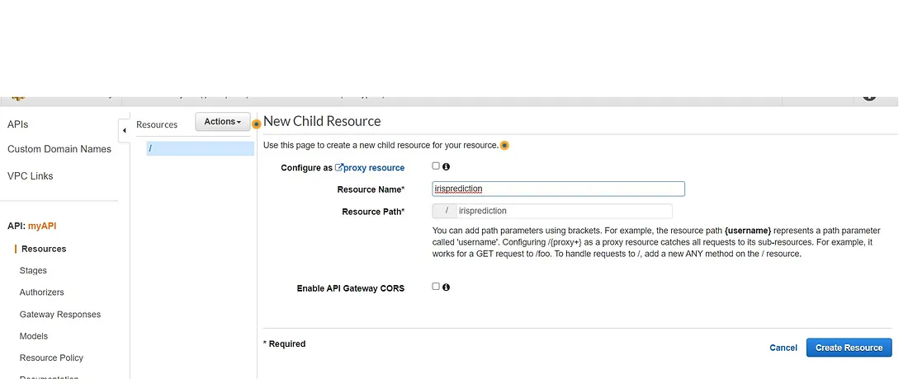
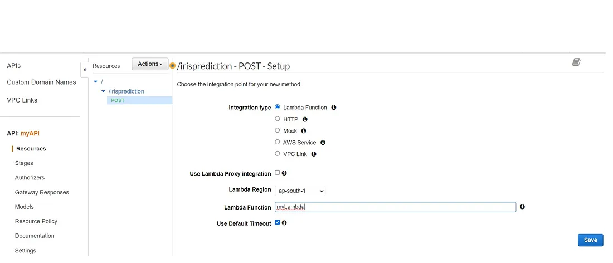
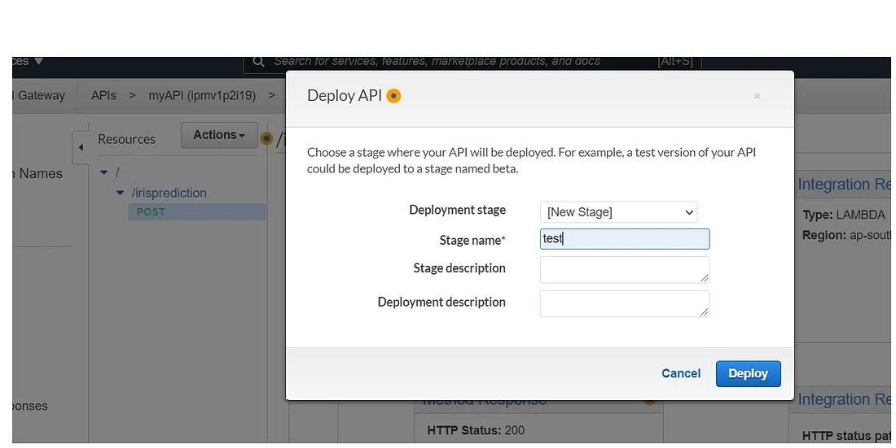
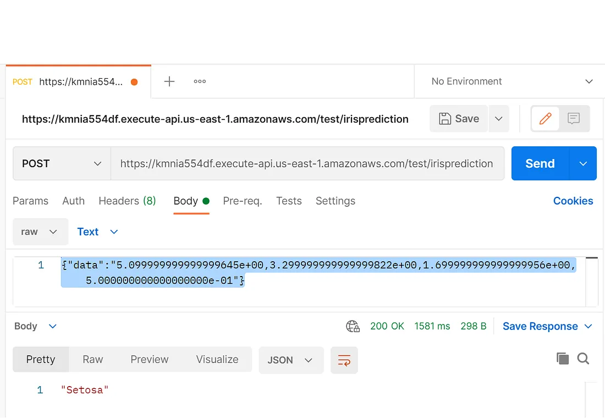

# Deploy local model lên AWS SageMaker

## Các service được sử dụng
- AWS SageMaker
- Amazon S3
- AWS Lambda
- AWS API Gateway
- AWS SageMaker Python SDK

## Deploy model sử dụng AWS SageMaker
- Train model trên máy local
- Upload file model lên AWS SageMaker. Thực hiện lưu file ở S3, tạo model object và endpoint, sau đó sử dụng Lambda và API Gateway để trigger endpoint
- Thực hiện test model đã deploy với 1 tập data

### Train model trên máy local
- Thực hiện train 1 model trên máy cá nhân, ví dụ này sử dụng xgboost model
- Sau khi đã thực hiện test, lưu file model dưới dạng *.pkl* sử dụng **joblib**
- Code train, test và lưu model: **script.ipynb**

```
from xgboost import XGBClassifier
clf = xgb.XGBClassifier()
clf.fit(X=x_train, y=y_train)
import joblib
filename = 'DEMO-local-xgboost-model'
joblib.dump(clf, filename)
```

### Deploy model lên AWS SageMaker
- Tạo 1 notebook instance trên SageMaker: Notebook -> Notebook instance -> Create Notebook instance
- Chọn kernel: conda_python3, upload các file **"model_name".pkl**, **test.csv** và **model_deployment.ipynb**
- Chạy lần lượt các dòng trong file **model_deployment.ipynb** (trừ dòng cuối cùng). Chi tiết từng bước được giải thích ở đầu mỗi dòng. Lưu ý cài đặt xgboost cùng version với xgboost trên máy local
- Sau khi đã chạy xong file model_deployment.ipynb, model endpoint sẽ được tạo ra: 
Inference -> Endpoints


- Lưu lại tên Endpoints để dùng cho phần tạo Lambda function

### Setup service - real-time inference

Để model vừa deploy trả ra kết quả khi nhập giá trị input, sử dụng API Gateway và AWS Lambda để trigger model endpoint và trả ra kết quả dự báo từ model

- Tạo IAM role với policy như dưới đây để cấp quyền cho Lambda gọi vào model endpoint

```
{
    "Version": "2012-10-17",
    "Statement": [
        {
            "Sid": "VisualEditor0",
            "Effect": "Allow",
            "Action": "sagemaker:InvokeEndpoint",
            "Resource": "*"
        }
    ]
}
```
- Tạo Lambda function: Author from scratch, Runtime: Python 3.8, Architecture x86_64, Change execution role: Use an existing role với IAM role vừa tạo ở trên 


- Nhập đoạn code vào function và bấm **Deploy**

```
import os
import boto3
import json
# grab environment variables
ENDPOINT_NAME = os.environ['ENDPOINT_NAME']
runtime= boto3.client('runtime.sagemaker')
def lambda_handler(event, context):
    print("Received event: " + json.dumps(event, indent=2))
    
    data = json.loads(json.dumps(event))
    payload = data['data']
    #print(payload)
    
    response = runtime.invoke_endpoint(EndpointName=ENDPOINT_NAME,
                                       ContentType='text/csv',
                                       Body=payload)
    #print(response)
    result = json.loads(response['Body'].read().decode())
   
    return result
```

- Tại tab Configuration, tạo biến môi trường **ENDPOINT_NAME**, giá trị trùng với tên của *model endpoint* đã tạo 


- Tạo 1 REST API và tích hợp với Lambda function:
    
    - Chọn REST API Public, build


    - Tại cửa sổ tiếp theo, chọn Create Resource và nhập tên resource 


    - Tiếp tục chọn Create method -> POST -> Lambda function. Nhập tên function đã tạo 


    - Chọn Deploy API, New stage ở tab Deployment stage và nhập tên stage, sau đó bấm Deploy


- Test API 
    - Nhập resource name đã tạo vào sau URL sinh ra từ API. Ví dụ https://kmnia554df.execute-api.us-east-1.amazonaws.com/test/"resource name"
    - Sử dụng Postman để test API đã tạo


Sau khi đã thực hiện xong, xóa các service trên AWS như Lambda, API Gateway, Sagemaker notebook instance và model endpoints để tránh phát sinh chi phí.